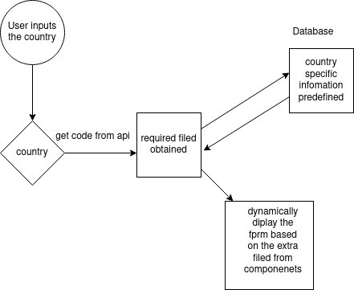

# Technical Proposal -Front End

---

### Problem Description

* Total number of fields required to onboard an employee changes with respect to the country .

### Assumptions

* - The required amount of time has been given to develop the POC of the proposed solution.

  - The public apis are available to get the values required to onboard an employee with compliance.

### Why should we solve it?

* In order to meet the compliance in onboarding an employee from a country, each of the required fields needed for the same must be recorded.

### How do I  propose to solve it?
* The new feature which  I am going to propose are the following :
    - 'HTTP' requests are sent from the backend server to the the public api of every country to check whether there is any change in the values of required fields to meet the compliance and successfully onboard an employee.
    - If there is any change , the smarcontracts are written in solidity to automatically write the hashes of those datas to the blockchain and the data can be stored at the decentralized database like IPFS so that the scalability in storing the huge amount of data can be achieved.
    - The country code must be recorded after the employee inputs the country from the form component.
    - Function components must be created to map the the country with their corresponding extra fields by retrieving the required fields with respect to the country code from the IPFS databse  by using the hashes stored at the blockchain.
    - Based on the required number of field obtained from the above , the form must be dynamically updated and displayed to the user.

### How do the proposed solution stand apart from the other ?

* - There is a possibility to introduce the incentivisation via ratings to each employee who performs really good at the remote work and successfully completes the contractual period for which the employee is hired to a company. These incentives are given through tokens that have value which can be redeemed.

  - These ratings will create confidence among employers to hire their employees from our platform compared to the other.

  -  There is a possibility to introduce the incentivisation via ratings to each employers as well who treat the employees very well during the period of conttractual remote work agreement . These incentive are given through tokens that have value which can be redeemed. These ratings will create the confidence in employees to choose the employers as well. 

### Feature WorkFlow

### What other approaches did you consider?

* - Each of the required fields for a specific country need to be predefined by the admin of this platform and must be saved to the normal databse.
  - The country code must be recorded after the employee inputs the country from the form component.
  - Function components must be created to map the the country with their corresponding extra fields by retrieving the required fields with respect to the country code from the databse.
  - Based on the required number of field obtained from the above , the form must be dynamically updated and displayed to the user.  

### What could go wrong?

* The public apis required to retrieve the data required must be found.
* Failed to do so , the proposed solution fails.
---

